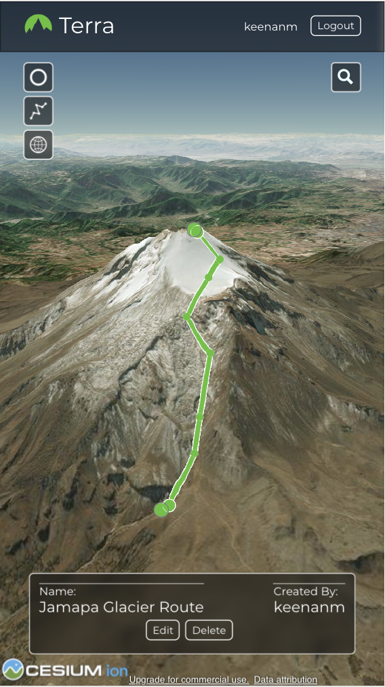

# Terra
Terra is a mapping app geared towards hikers, climbers, mountaineers.
It allows users to drop waypoints and draw routes on a 3D terrain map of the world.
Users can share their routes with the community and access routes left by others.

Create a user account to view or add waypoints and routes.
Use the searchbar on the right side of the page to find locations around the world.
Use the toolbar to select a waypoint or route tool and to toggle whether you'd like to view routes and waypoints added by the community or just your own.
Click on a route or waypoint to see the name and description associated with it.

### Live App
https://terra-app.keenanmcdonald.now.sh/

### API Repo
https://github.com/keenanmcdonald/terra-server

### Screenshots
Desktop:

Mobile: 

### Technology Used
Front End: Javascript, React, CesiumJS library used for 3D mapping, Resium used to help integrate Cesium with React.
Back End: NodeJS, Express

### Demo Login Credentials
email: demo@thinkful.com
password: Thinkful123